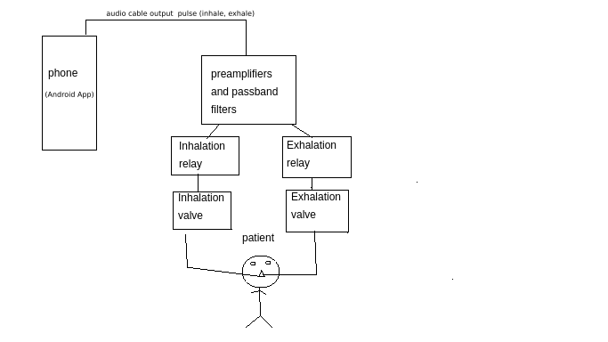

# medical-ventilator (experimental, and homemade, use and test at your own risk)
Cheap, Urgent medical ventilator based on Android device as controller.

### contact us: testsoft1020@gmail.com
you can download and install the apk located on this project at apk/app-debug.apk
Later I  will attach more files, I would use the Audio plug to control the Ventilator hardware.
Then some audio filters to active relays and valves.
Inspired on this video :
https://www.youtube.com/watch?v=ahumLb8pWBc&feature=youtu.be

Urgente y barato respirador medico usando un dispositivo Android.
Luego agregaré mas archivos, usaríamos el connector plug de audio para controlar el hardware del respirador.
Luego unos filtros de audio para activar reles y mover las valvulas.

this is a video demo of the current android app:

https://youtu.be/MyRuTMg1WNE

this is a demo getting the output signal and turning on  a led when the signal pulses:

https://youtu.be/7ZbFkVpHy6o

inspirado en este video:
https://www.youtube.com/watch?v=ahumLb8pWBc&feature=youtu.be

here you have a complex sample also using valves:

https://www.youtube.com/watch?v=2nvR4Bsqw9M

# Experiments resume:
I tested the app with a pre amplifier using a bc546b transistor and  a power supply of dc 8V (generic transformer) and I got an ac output of 4.5v (http://hackaweek.com/hacks/the-single-npn-transistor-audio-preamp/)

 so then I would filter both signals and activate the relays.

